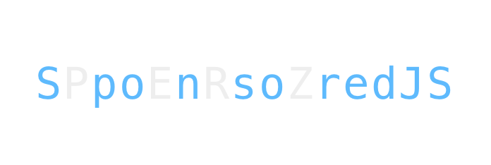

<p align="center">
  
</p>

Are you fed up with your users hiding your well-crafted ads? Do you want to keep your revenues against your designers' advices? Don't go further and start using `SponsoredJS`.
Joke aside, this library is my attempt to obfuscate a message that is displayed in the client (eg: Facebook's sponsored post) using React. As such this is a dark pattern that should be avoided.

## Installation
To install the latest version:
```
yarn add sponsoredjs
```
Or if you are using npm:
```
npm install --save sponsoredjs
```

## Let’s Get Started!

```
import Sponsored from 'sponsoredjs'

<Sponsored message="Sponsorisé" />
```

- `message` a required string, the message that will be obfuscated.
- `style` an optional object, apply style to the wrapper. (try to avoid using this, as it will help targeting the rendered elements)